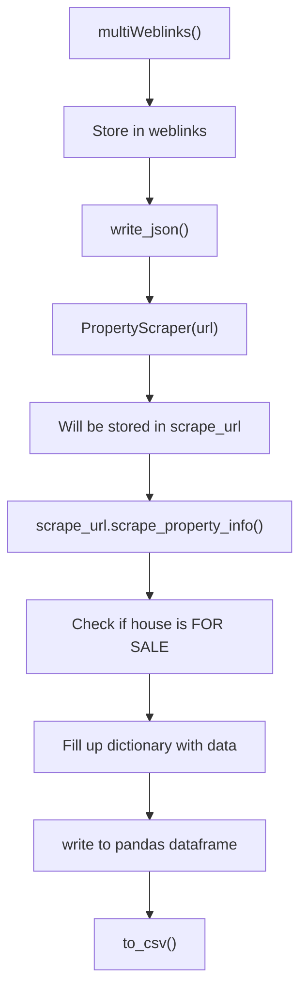

# Immozilla
[](https://www.python.org/)


## 📖 Description
This Python project employs web scraping techniques to compile a dataset of real estate properties in Belgium. Specifically, we utilized Immoweb to gather information on +10,000 houses and apartments available for sale across the country.

The outcome of this project provides us with the following headers in our files:

* property_id
* locality_name
* postal_code
* street_name
* house_number
* latitude
* longitude
* property_type (house or apartment)
* property_subtype (bungalow, chalet, mansion, ...)
* price
* type_of_sale (note: exclude life sales)
* number_of_rooms (Number of rooms)
* living_area (Living area (area in m²))
* kitchen_type
* fully_equipped_kitchen (0/1)
* furnished (0/1)
* open_fire (0/1)
* terrace
* terrace_area (area in m² or null if no terrace)
* garden
* garden_area (area in m² or null if no garden)
* surface_of_good
* number_of_facades
* swimming_pool (0/1)
* state_of_building (new, to be renovated, ...)


## 🛠 Installation

* clone the repo
```bash
git clone git@github.com:NathNacht/immo-eliza-scraping-immozila.git
```

* Install all the libraries in requirements.txt
```bash
pip install -r requirements.txt
```

* Run the script
```bash
$ python3 main.py
```

You will be asked to specify the number of pages to be scraped. Fill in a number.

* The output will be stored in ./data/cleaned/clean.csv

## 👾 Workflow

### main



## 🚀 Usage

The project involves discovering and saving the links to the locations of all properties in JSON files. Subsequently, each link undergoes thorough processing to extract the necessary information, which is then transformed into a DataFrame. Finally, the obtained information is written to a CSV file.

## 🤖 Project File structure
```
├── data
│   ├── cleaned
│   └── raw
├── example_data
├── scraper
│   ├── scraper.py
│   └── threathimmolinks.py
├── .gitignore
├── main.py
├── README.md
└── requirements.txt
```


## 🔍 Contributors
- [Nathalie Nachtergaele](https://github.com/NathNacht)
- [Jens Dedeyne](https://github.com/DedeyJ)
- [Alfiya Khabibullina](https://github.com/justalphie)
- [Sem Deleersnijder](https://github.com/semdeleer)

## 📜 Timeline

This project was created in 5 days.