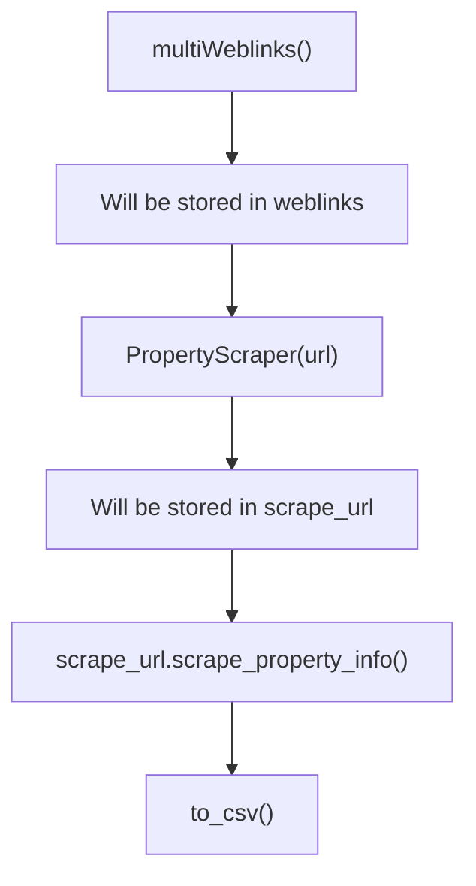

# immozilla
[](https://www.python.org/)

##  Description
This Python project employs web scraping techniques to compile a dataset of real estate properties in Belgium. Specifically, we utilized Immoweb to gather information on 10,000 houses and apartments available for sale across the country.

The outcome of this project provides us with the following headers in our files:

* Property ID
* Locality name
* Postal code
* Price
* Type of property (house or apartment)
* Subtype of property (bungalow, chalet, mansion, ...)
* Type of sale (note: exclude life sales)
* Number of rooms
* Living area (area in m²)
* Equipped kitchen (0/1)
* Furnished (0/1)
* Open fire (0/1)
* Terrace (area in m² or null if no terrace)
* Garden (area in m² or null if no garden)
* Surface of good
* Number of facades
* Swimming pool (0/1)
* State of building (new, to be renovated, ...)


##  Installation

* clone the repo
* Install all the libraries in requirements.txt

```bash
$ python3 main.py
```

* everything wil be stored in ./data/csvdump.csv. 

##  Workflow

### main


##  Usage

The project involves discovering and saving the links to the locations of all properties in JSON files. Subsequently, each link undergoes thorough processing to extract the necessary information, which is then transformed into a DataFrame. Finally, the obtained information is written to a CSV file.

## Visuals
```
Project Tree
├── data
│   ├── cleaned
│   └── raw
├── example_data
├── scraper
│   ├── scraper.py
│   └── threathimmolinks.py
├── .gitignore
├── main.py
├── README.md
└── requirements.txt
```


##  Contributors
- [Nathalie Nachtergaele](https://github.com/NathNacht)
- [Jens Dedeyne](https://github.com/DedeyJ)
- [Alfiya Khabibullina](https://github.com/justalphie)
- [Sem Deleersnijder](https://github.com/semdeleer)

##  Timeline

This project was created in 5 days.